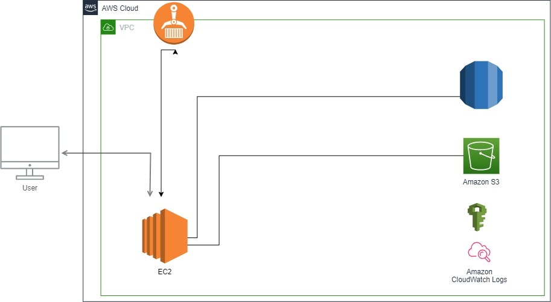

# S3-TERRAFORM-VPC-SUBNET-DOCKER

Vividart is an Editing photo tool in flask with storing in an S3 bucket

## Table of Contents

- [Overview](#Overview)
- [Architecture](#Architecture)
- [Technologies](#Technologies)
- [Usage](#usage)
- [Contributing](#contributing)
- [License](#license)

1-	Overview
2-	Solution proposed
3-	Architecture
4-	Services to use
5-	Conclusion

## Overview

VividArt Studios is a photo editing platform that seeks innovative solutions for seamless, dynamic photo transformations.
Cloud Engineers are called to collaborate in order to build a solution using modern technologies that only meet but exceeding the expectations of our clients.
Let’s embark into this thrilling journey, utilizing technologies to manage the crucial uploading phase as we strive to achieve unparalleled photo transformations.

## Architecture

## Technologies

- Python Serving as the primary programming language, Python provides a versatile and
efficient foundation for our photo editing platform. Its readability, extensive libraries, and
community support make it an ideal choice for crafting scalable and maintainable code.
- Flask: Leveraging the Flask web framework, we ensure the development of a lightweight yet
powerful application. Flask allows the creation of web applications with flexibility, aligning
perfectly with the needs of our dynamic photo editing platform.
- Pillow: As an essential imaging library for Python, Pillow plays a crucial role in handling various
image processing tasks. Its capabilities, ranging from basic operations to complex
transformations, empower our application to deliver high-quality and customized photo edits.
- Boto3: With Boto3, the Amazon Web Services (AWS) Software Development Kit (SDK) for
Python, we seamlessly integrate our application with AWS services. This facilitates efficient
communication with AWS resources, ensuring secure and scalable storage of images on
services like S3 bucket
- And more like html, css, etc.

## Usage

To operationalize our solution effectively, follow these straightforward steps to deploy and manage the infrastructure using Terraform:

To operationalize our solution effectively, follow these straightforward steps to deploy and manage the infrastructure using Terraform:
- Download the Terraform File:

Access the Terraform file from our designated repository or platform.

Ensure you have the necessary permissions and access to the file.
- Run terraform init:

Open your terminal or command prompt and navigate to the directory containing the Terraform file.

Execute the command terraform init.

This command initializes the Terraform file, downloading any required packages and setting up the environment for infrastructure creation
- Run terraform apply:

Execute the command terraform apply.

This command triggers the creation of various services defined in the Terraform file, orchestrating the deployment of the specified infrastructure.

Review the proposed changes and confirm the action when prompted

## Contributing

Information on how others can contribute to the project, such as reporting bugs or submitting pull requests.

## License

This project is licensed under the [License Name](LICENSE) - see the [LICENSE](LICENSE) file for details.
